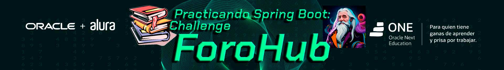

<!-- markdownlint-disable MD041 -->
<!-- markdownlint-disable MD033 -->
<!-- markdownlint-disable MD032 -->
<!-- markdownlint-disable MD022 -->

El desafío ForoHub consiste en crear una aplicación web que administre un foro. Aclarando que esta etapa backend se centrará en lo referido a los tópicos. Es decir que deberá permitir que un usuario autenticado y autorizado pueda realizar un CRUD de los tópicos.

La aplicación que procura cumplir con tales requisitorias fue desarrollada en Java JDK v.17, usando el IDE IntelliJ IDEA.

La configuración incial se hizo con Spring Initializr, seleccionado: 
- Project: Maven; 
- Language: Java; 
- Spring Boot: 3.3.1; 
- Packaging: Jar; 
- Java: 17; 

y las dependencias: 
- Swagger, 
- Lombok, 
- Spring Web, 
- Spring Boot DevTools, 
- Spring Data JPA, 
- Flyway Migration, 
- MySQL Driver, 
- Validation,
- Spring Security.

La base de datos usada para realizar los registros es MySQL 8.0, pudiendo visualizar tales registros a travez de su herramienta Workbench.

Otra herramienta usada para probar los endpoints fue: Insomnia.

<!-- markdownlint-enable MD033 -->
* © 2024 Policarpo Acho.
